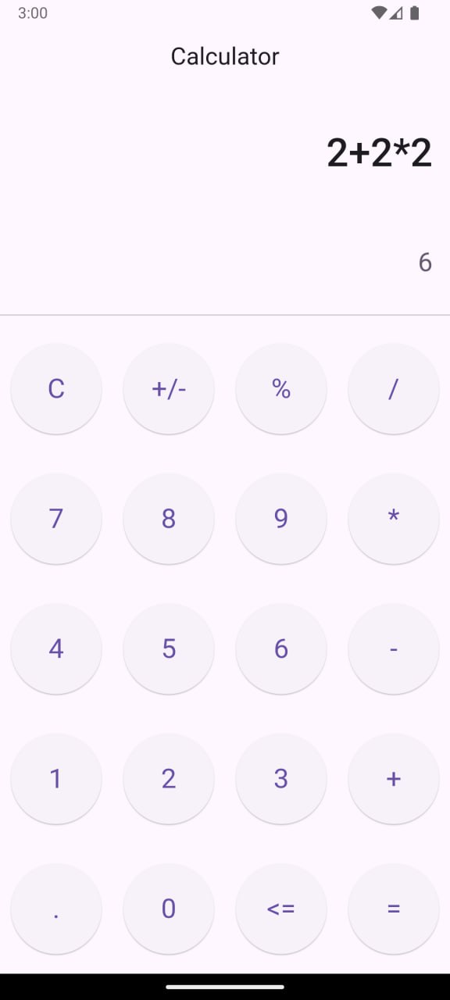

# Калькулятор на Flutter с использованием BLoC

## Описание проекта

Это приложение-калькулятор, разработанное на Flutter с использованием архитектуры BLoC (Business Logic Component). Калькулятор принимает на вход математические выражения в виде строки (например, `"2+2"`), токенизирует их, преобразует в постфиксную запись с помощью алгоритма сортировочной станции (Shunting Yard Algorithm) и рассчитывает результат.



## Особенности

- **Архитектура BLoC**: логика и состояние приложения разделены, что упрощает тестирование и поддержку.
- **Парсинг выражений**: поддержка операций с приоритетами и скобок.
- **Алгоритм сортировочной станции**: преобразование инфиксной записи выражений в постфиксную (обратную польскую нотацию).
- **Токенизация**: входная строка разбивается на токены для дальнейшей обработки.
- **Поддержка основных математических операций**: сложение, вычитание, умножение, деление и работа со скобками.

## Стек технологий

- **Flutter**: для разработки пользовательского интерфейса.
- **Flutter BLoC**: для управления состоянием приложения.
- **Dart**: основной язык разработки.

## Установка

1. Убедитесь, что у вас установлен Flutter SDK.
2. Клонируйте репозиторий:

   ```bash
   git clone https://github.com/F0rgenet/flutter-calculator.git
   cd flutter-calculator
   ```

3. Установите зависимости:

   ```bash
   flutter pub get
   ```

4. Запустите приложение:

   ```bash
   flutter run
   ```

## Структура проекта

- **`lib/`**
    - **`bloc/`**: содержит файлы для управления состоянием (BLoC и события).
    - **`core/`**: содержит основные модули, такие как токенизация и парсинг.
    - **`ui/`**: пользовательский интерфейс приложения.
    - **`main.dart`**: точка входа в приложение.

## Как работает приложение

### Токенизация

Введённая строка (например, `"2+2"`) разбивается на токены, которые содержат:

- Значение токена (число или оператор).
- Тип токена (число, оператор, скобка и т.д.).

### Алгоритм сортировочной станции

1. Входная строка преобразуется в инфиксное выражение (список токенов).
2. Алгоритм сортировочной станции преобразует это выражение в постфиксную запись, соблюдая приоритет операций и ассоциативность.
3. Постфиксная запись передаётся на расчёт результата.

### Расчёт результата

Постфиксное выражение обрабатывается с использованием стека, чтобы выполнить вычисления.

## Пример работы

1. Пользователь вводит: `"2+2"`.
2. Токенизация создаёт следующий список:
   ```
   [ 2, +, 2]
   ```
3. Алгоритм сортировочной станции преобразует в:
   ```
   [ 2, 2, + ]
   ```
4. Вычисляется результат: `4`.

## Файлы ключевых компонентов

- **`bloc/calculator_bloc.dart`**: управляет событиями и состоянием калькулятора.
- **`core/utils/tokenizer.dart`**: модель для токенов выражений.
- **`core/utils/parser.dart`**: содержит реализацию алгоритма сортировочной станции.

## Контакты

- **Автор**: Павел Елисеев
- **GitHub**: [github.com/f0rgenet](https://github.com/f0rgenet)
- **Email**: [forgenet@inbox.ru](mailto:forgenet@inbox.ru)
